# Summary
https://www.educative.io/courses/grokking-the-coding-interview/3YVYvogqXpA
# 1d interval search
- Instead of point, our data is interval
- Support of following operations
    - insert
    - search for interval
    - delete an interval
    - interval intersection query
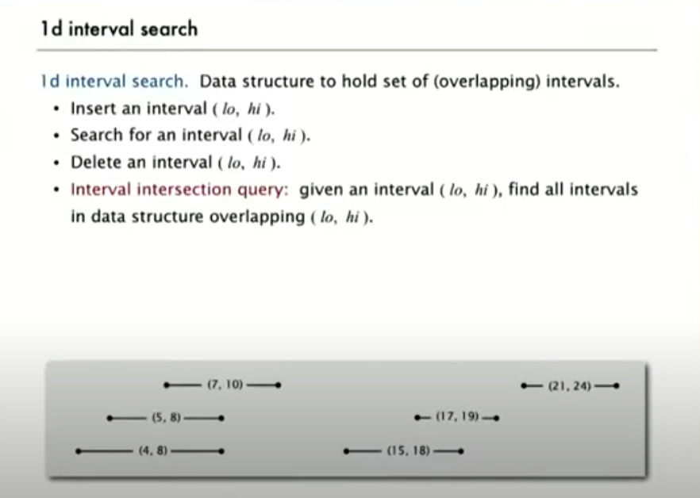
- Use left point of each interval as binary search tree key
- Store max endpoint in subtree rooted at node
# Interval search tree
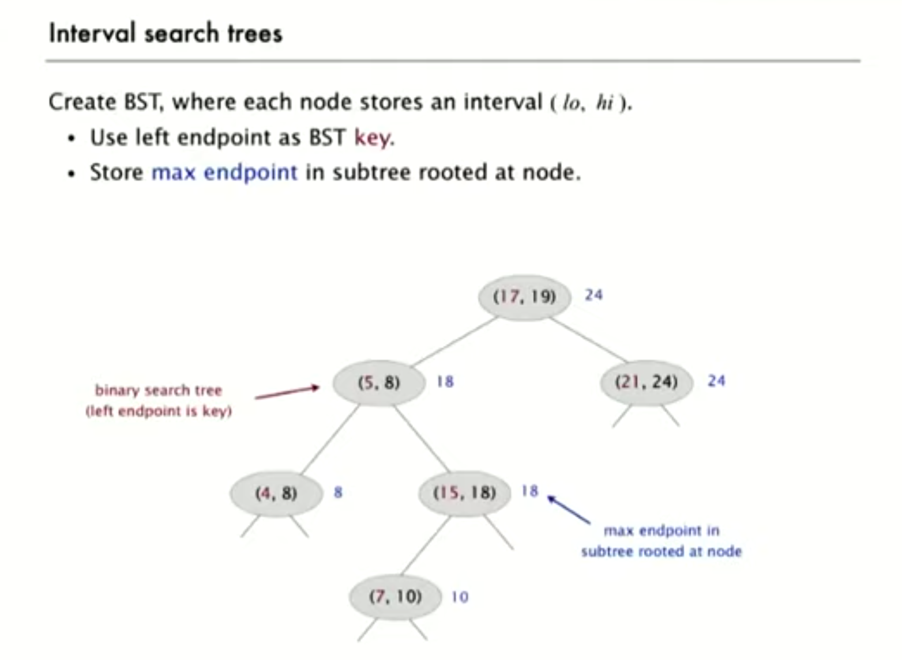
# Insert interval
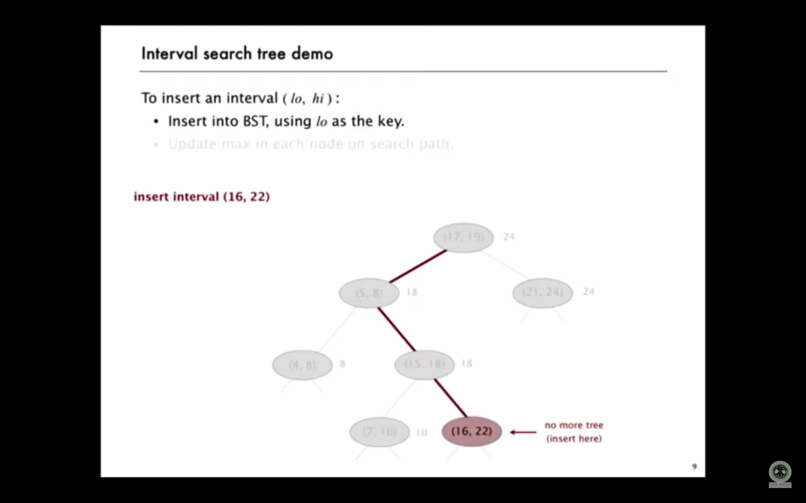
# Search interval
- Use case 1
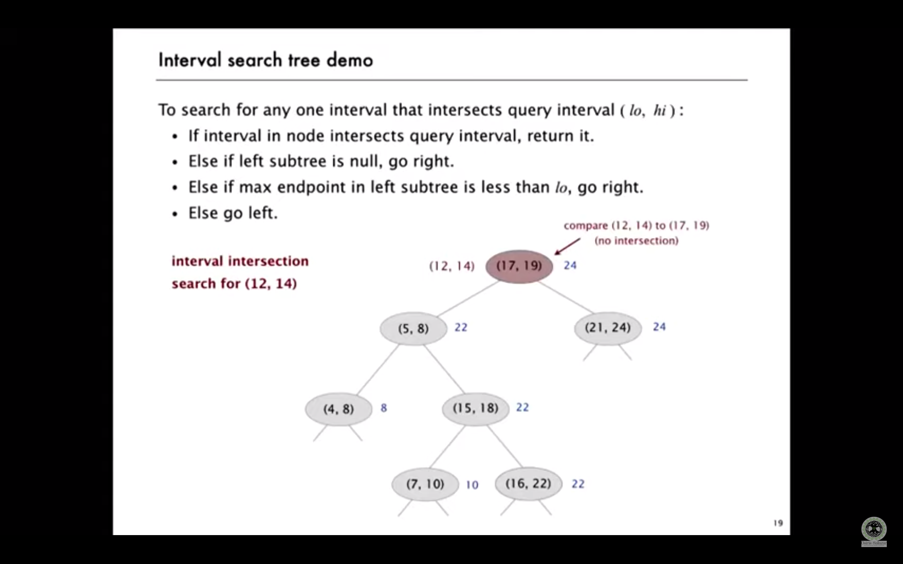
- Use case 2
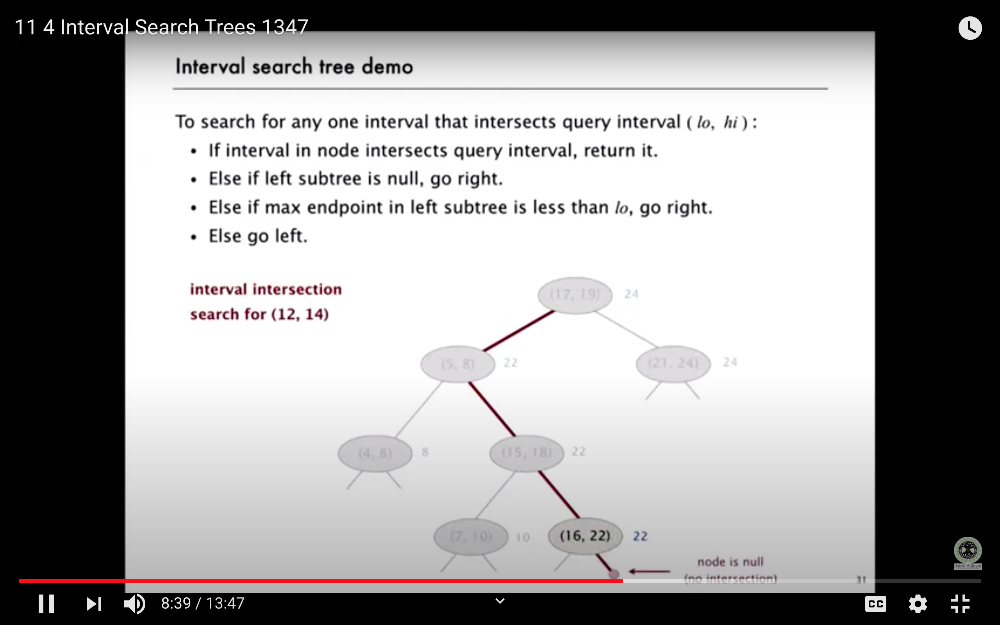
- Use case 3
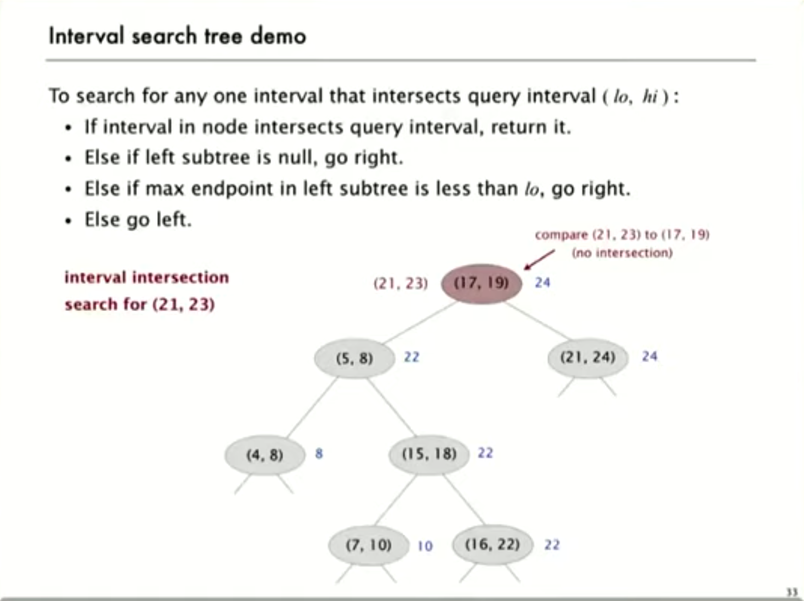
- Algorithm
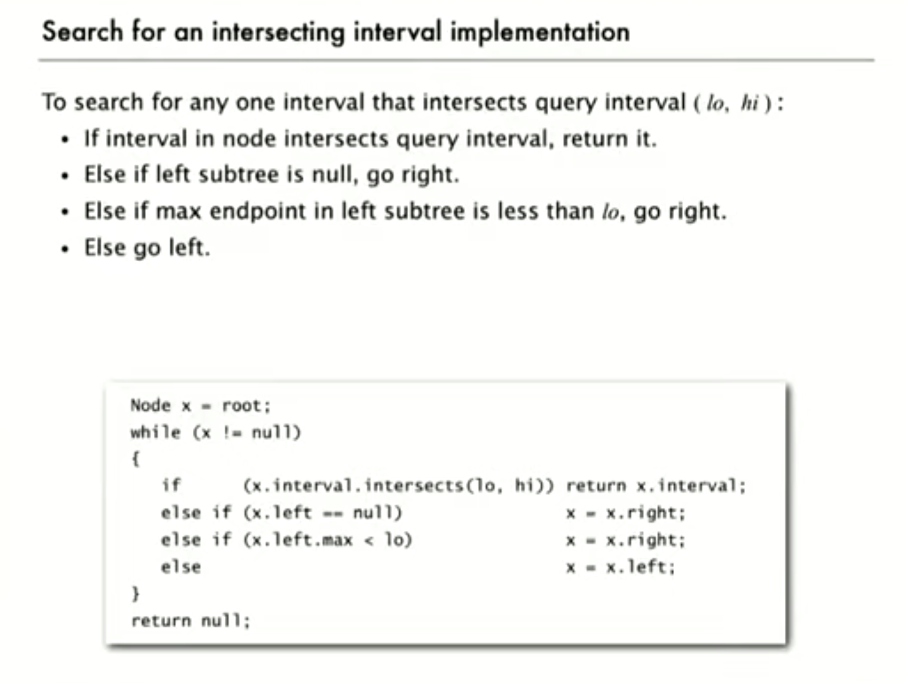
- Proof 1
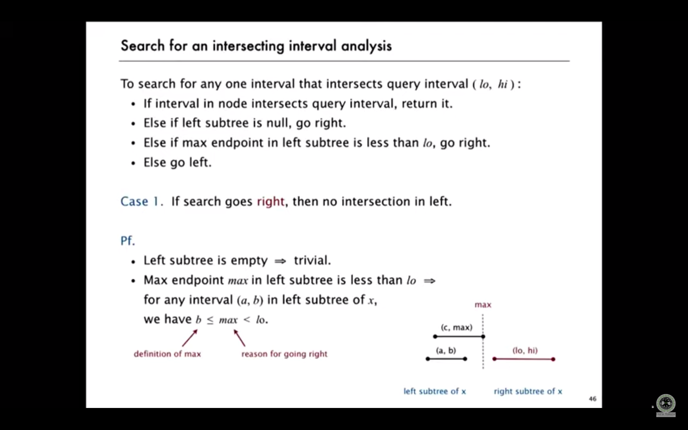
- Proof 2
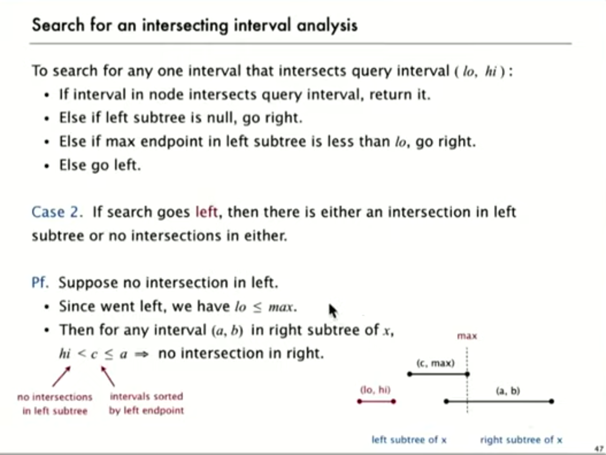
# Time complexity
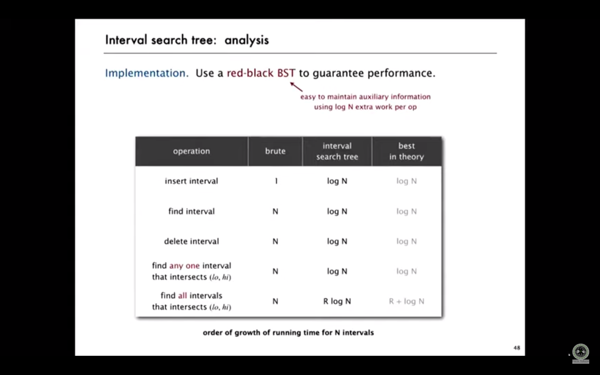
# Orthogonal line segment intersection
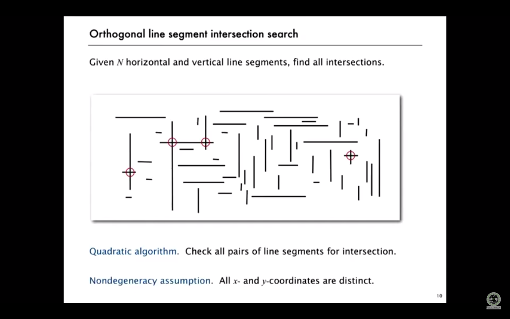
# Sweep line algo
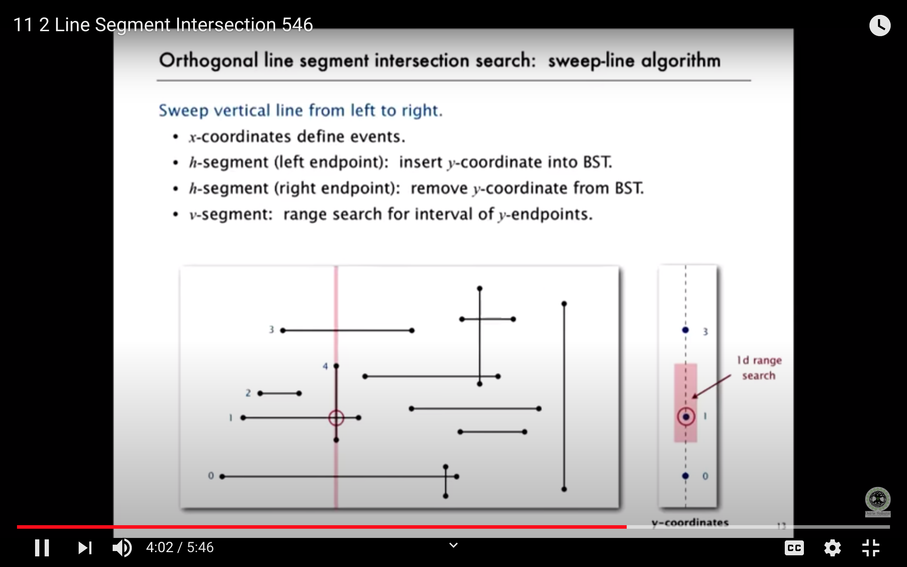
# Sweep line algo analysis
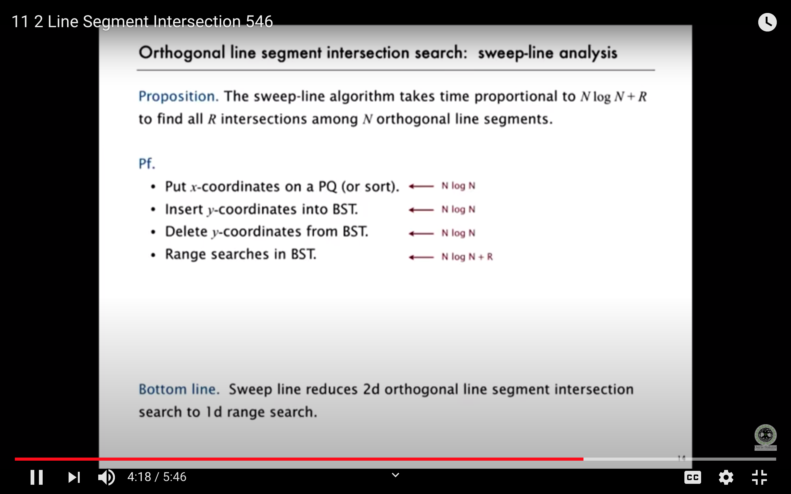

# Problems
https://leetcode.com/problems/meeting-rooms/

https://leetcode.com/problems/meeting-rooms-ii/

https://leetcode.com/problems/merge-intervals/

https://leetcode.com/problems/insert-interval/

https://leetcode.com/problems/interval-list-intersections/

https://leetcode.com/problems/employee-free-time/

https://leetcode.com/problems/range-module/
