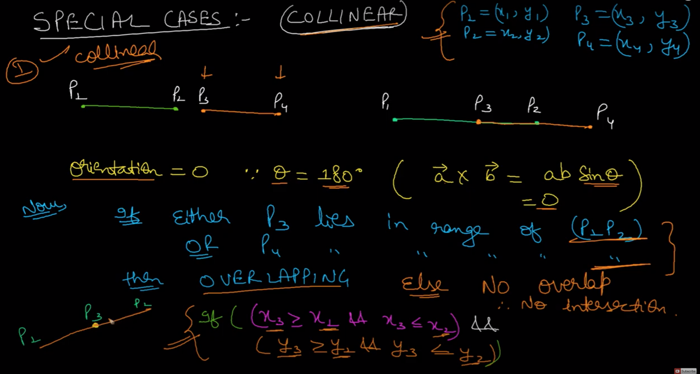

# Distance between two points
https://prismoskills.appspot.com/lessons/2D_and_3D_Puzzles/Chapter_05_-_Distance_between_points.jsp
https://en.wikipedia.org/wiki/Taxicab_geometry

## Manhattan Distance
is defined as Math.abs(x2-x1) + Math.abs(y2-y1).
## Euclidean Distance
is defined as sqrt ((x2-x1)2 + (y2-y1)2).
https://leetcode.com/problems/minimum-time-visiting-all-points/
# Vectors
- Vectors are the basis of a lot of methods for solving geometry problems. 
- Formally, a vector is defined by a direction and a magnitude. 
- In the case of two-dimension geometry, a vector can be represented as pair of numbers, x and y, which gives both a direction and a magnitude. 
- For example, the line segment from (1,3) to (5,1) can be represented by the vector (4,-2). 
- It’s important to understand, however, that the vector defines only the direction and magnitude of the segment in this case, and does not define the starting or ending locations of the vector.

# Vector Addition
- There are a number of mathematical operations that can be performed on vectors. 
- The simplest of these is addition
- you can add two vectors together and the result is a new vector. 
- If you have two vectors (x1, y1) and (x2, y2), then the sum of the two vectors is simply (x1+x2, y1+y2). 
- The image below shows the sum of four vectors. 
- Note that it doesn’t matter which order you add them up in – just like regular addition. 


https://cnx.org/contents/Qk0ZZlcl@7/Vector-addition

# Dot Product
- The addition of vectors is relatively intuitive; a couple of less obvious vector operations are dot and cross products. 
- The dot product of two vectors is simply the sum of the products of the corresponding elements. 
- For example, the dot product of (x1, y1) and (x2, y2) is x1*x2 + y1*y2. 
- Note that this is not a vector, but is simply a single number (called a scalar). 
- The reason this is useful is that the dot product, A ⋅ B = |A||B|Cos(θ), where θ is the angle between the A and B. 
- |A| is called the norm of the vector, and in a 2-D geometry problem is simply the length of the vector, sqrt(x2+y2). 
- Therefore, we can calculate Cos(θ) = (A ⋅ B)/(|A||B|). 
- By using the acos function, we can then find θ. 
- It is useful to recall that Cos(90) = 0 and Cos(0) = 1
- as this tells you that a dot product of 0 indicates two perpendicular lines, and that the dot product is greatest when the lines are parallel. 
- A final note about dot products is that they are not limited to 2-D geometry. 
- We can take dot products of vectors with any number of elements, and the above equality still holds.

# Cross Product
- An even more useful operation is the cross product. 
- The cross product of two 2-D vectors is x1*y2 - y1*x2 
- Technically, the cross product is actually a vector, and has the magnitude given above, and is directed in the +z direction. 
- Since we’re only working with 2-D geometry for now, we’ll ignore this fact, and use it like a scalar. 
- Similar to the dot product, A x B = |A||B|Sin(θ). However, θ has a slightly different meaning in this case: 
- |θ| is the angle between the two vectors, but θ is negative or positive based on the right-hand rule. 
- In 2-D geometry this means that if A is less than 180 degrees clockwise from B, the value is positive. 
- Another useful fact related to the cross product is that the absolute value of |A||B|Sin(θ) is equal to the area of the parallelogram with two of its sides formed by A and B. 
- Furthermore, the triangle formed by A, B and the red line in the diagram has half of the area of the parallelogram, so we can calculate its area from the cross product also.


# Area of polygon
- Consider a problem where we are given the vertices of a quadrilateral (a polygon that has four vertices), and our task is to calculate its area.

One way to approach the problem is to divide the quadrilateral into two triangles by a straight line between two opposite vertices:

- After this, it suffices to sum the areas of the triangles.
- The area of a triangle can be calculated, for example, using Heron’s formula

where a, b and c are the lengths of the triangle’s sides and s = (a+ b + c)/2.

- Sometimes we cannot just pick two arbitrary opposite vertices. 
- For example, in the following situation, the division line is outside the quadrilateral:


- However, it turns out that we can solve the problem using another method that is more convenient to a programmer. Namely, there is a general formula
```
abs(x1 y2 − x2 y1 + x2 y3 − x3 y2 + x3 y4 − x4 y3 + x4 y1 − x1 y4)/2
```
https://leetcode.com/problems/check-if-it-is-a-straight-line/
https://leetcode.com/problems/minimum-area-rectangle/
https://leetcode.com/problems/minimum-area-rectangle-ii/
https://leetcode.com/problems/minimum-area-rectangle/
# Concept of orientation 


# Intersection of two line segments
- Draw vector
- Use case 1:

- Use case 2:

Assume 0 as always opposite to found orientation
- Use case 3:


- Use case 4:


# Line Sweep Technique


https://leetcode.com/problems/meeting-scheduler/
https://leetcode.com/problems/remove-interval/
https://leetcode.com/problems/remove-covered-intervals/


https://leetcode.com/problems/container-with-most-water/
https://leetcode.com/tag/line-sweep/

# Interval
http://www.dgp.toronto.edu/~jstewart/378notes/22intervals/

# Reference 
https://www.topcoder.com/community/competitive-programming/tutorials/geometry-concepts-basic-concepts/

https://cses.fi/book/book.pdf

https://www.youtube.com/watch?v=WAyPIMme3Yw&ab_channel=mycodeschool

https://massivealgorithms.blogspot.com/2014/09/given-n-line-segments-find-if-any-two.html

https://www.topcoder.com/community/competitive-programming/tutorials/line-sweep-algorithms/

https://www.mathsisfun.com/algebra/matrix-determinant.html


https://www.mathsisfun.com/algebra/scalar-vector-matrix.html#:~:text=A%20vector%20is%20a%20list,%2C%20one%20or%20more%20columns).

https://www.mathsisfun.com/algebra/vectors-dot-product.html

https://www.mathsisfun.com/algebra/vectors-cross-product.html

https://www.mathsisfun.com/polar-cartesian-coordinates.html

